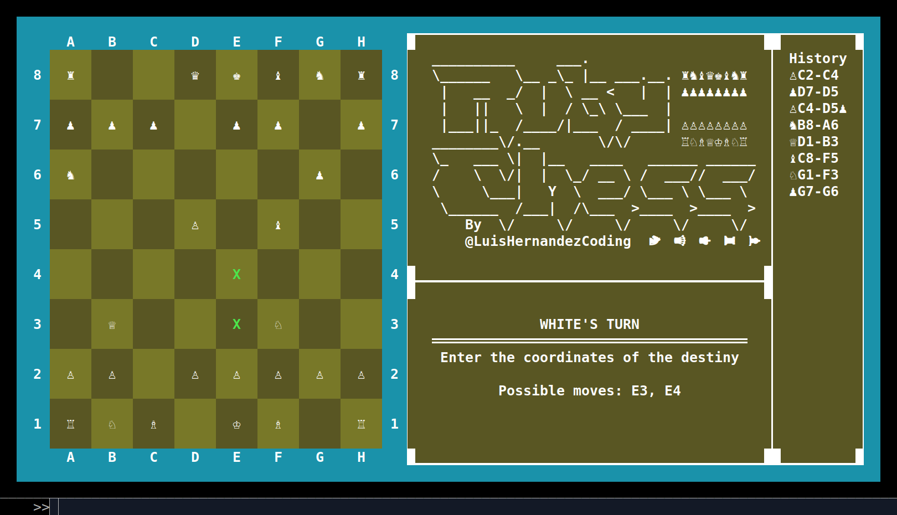

# Chess game in ruby

In this project i build a Chess game in ruby!, it can be executed and displayed in the console, and it can be played by two players, one player is the white player and the other player is the black player, each player can move one piece at a time, the game is over when the king of one player is captured by the other player.

###### - Extra: It can be saved every turn by input save and it can be loaded 

## Previews
> Menu preview

> 
> Preview start

> 
> Preview some moves

> 
> Preview some moves 2

> 

## The Game

#### Definition
> 'Chess' is a two-player strategy board game played on a chessboard, a checkered game board with 64 squares arranged in an eight-by-eight grid. It is one of the world's most popular games, played by millions of people worldwide in homes, parks, clubs, online, by correspondence, and in tournaments. Each player begins the game with 16 pieces: one king, one queen, two rooks, two knights, two bishops, and eight pawns. Each of the six piece types moves differently. Pieces are used to attack and capture the opponent's pieces, with the objective to 'checkmate' the opponent's king by placing it under an inescapable threat of capture. To this end, a player's pieces are used to attack and capture the opponent's pieces, while supporting each other so that none of the player's pieces are left in a vulnerable position that would allow the opponent to give check.

#### Rules
The rules of chess are fairly simple. 
- Each player starts with 16 pieces
	- 1 king
	- 1 queen
	- 2 rooks
	- 2 knights
	- 2 bishops and 
	-  8 pawns
- The goal of the game is to checkmate the opponent's king. 
- The king is in check when it is under threat of capture. 
- The king is in checkmate when it is in check and there is no way to prevent capture. 
- The game ends when one player is checkmated. 
- A draw can also occur if the game is not won by either player before the 50-move rule or the threefold repetition rule is satisfied.

#### Pieces
###### The pieces are the following: King, Queen, Rooks, Knights, Bishops, and Pawns.

##### The King
> The King can move one square in any direction, as long as that square is not attacked by an enemy piece. Additionally, the king can perform a special move, known as castling. This move involves moving the king two squares toward a rook on the player's first rank, and then moving the rook to the square over which the king crossed.

##### The Queen
> The Queen can move any number of unoccupied squares in a straight line vertically, horizontally, or diagonally, thus combining the moves of the rook and bishop. The queen captures by occupying the square on which an enemy piece sits.

##### The Rooks
> The Rooks can move any number of unoccupied squares along a rank or file, but may not leap over other pieces. Along with the king, a rook is involved during the king's castling move. Rooks move when the king castles kingside or queen's side.

##### The Bishops
> The Bishops can move any number of unoccupied squares diagonally, but may not leap over other pieces. Bishops combine the power of a rook and a knight. Bishops have the same power as rooks, but are limited to diagonal movement.

##### The Knight
> The Knights move to any of the closest squares that are not on the same rank, file, or diagonal, thus the move forms an "L"-shape: two squares vertically and one square horizontally, or two squares horizontally and one square vertically. The knight is the only piece that can leap over other pieces. The knight moves to the nearest square not on the same rank, file, or diagonal

##### The Pawns
> The Pawns move forward to the unoccupied square immediately in front of them on the same file, or optionally to the second unoccupied square in front of them on the same file, provided they have not yet made a move. A pawn has two special moves: the en passant capture and promotion.

#### How to play
> - The game is played on a chessboard, a checkered game board with 64 squares arranged in an eight-by-eight grid. The colors of the 64 squares alternate and are referred to as "light squares" and "dark squares". The chessboard is placed between the players with a light square at the right-hand corner of the rank nearest to each player. Each player begins the game with 16 pieces: one king, one queen, two rooks, two knights, two bishops, and eight pawns. Each player's 16 pieces are divided into two "colors": white and black. A player's pieces are always of the same color and the opponent's pieces are always of the opposite color.

> - The game is played by two players. White moves first, then the players alternate in moving one piece per move. The game ends when checkmate occurs, when a player resigns, or when a draw is agreed. A draw can also occur if the game is not won by either player before the 50-move rule or the threefold repetition rule is satisfied.

## Learning outcome

##### Learning Goals / Areas of Focus

- Ruby
- Test Driven Development (TDD)
- Object Oriented Programming (OOP)
- Data Structures & Algorithms
- Encapsulation
- Design Patterns

##### Extra Learning Goals

- Git and GitHub
- Persistence
- Serialization
- YAML
- Ruby Style Guide
- Project Management
- Version Control
- Code Review

## Built With

- VS Code
- Ruby
- RSpec
- Rubocop
- Git flow
- Github


## Getting Started

To get a local copy up and running follow these simple example steps.

#### Prerequisites

- Ruby v 3.1.2p20 for running the game
- Rspec v 3.12 for running the tests


#### Setup

- Make sure you have Ruby installed on your machine
- Clone this repository with
```bash
git clone git@github.com:LuisHernandezCoding/Chessgame_ruby.git
```

#### Usage

- Navigate with your console to the project folder
- Run the program on your local machine with

```bash
ruby bin/main.rb
```

#### Run tests

- Navigate with your console to the project folder
- Run the program on your local machine with

```bash
rspec
```

# Author

👤 **Luis Hernandez**

- GitHub: @LuisHernandezCoding

## Credits

#### Project made mainly for 
[The Odin Project](https://www.theodinproject.com)
[(Full stack ruby on rails)](https://www.theodinproject.com/paths/full-stack-ruby-on-rails/courses/ruby)
[Ruby Chess](https://www.theodinproject.com/lessons/ruby-ruby-final-project)
